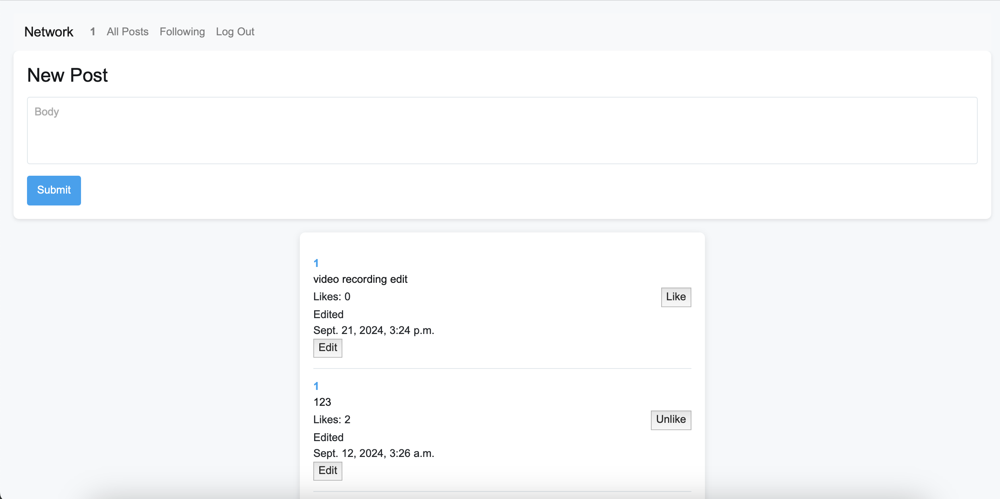
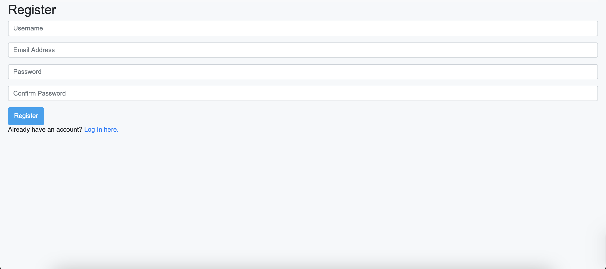
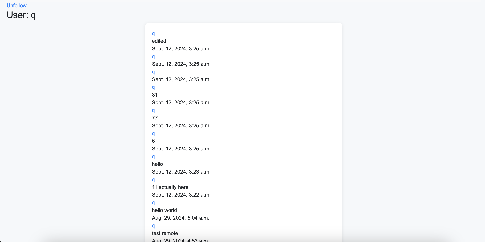
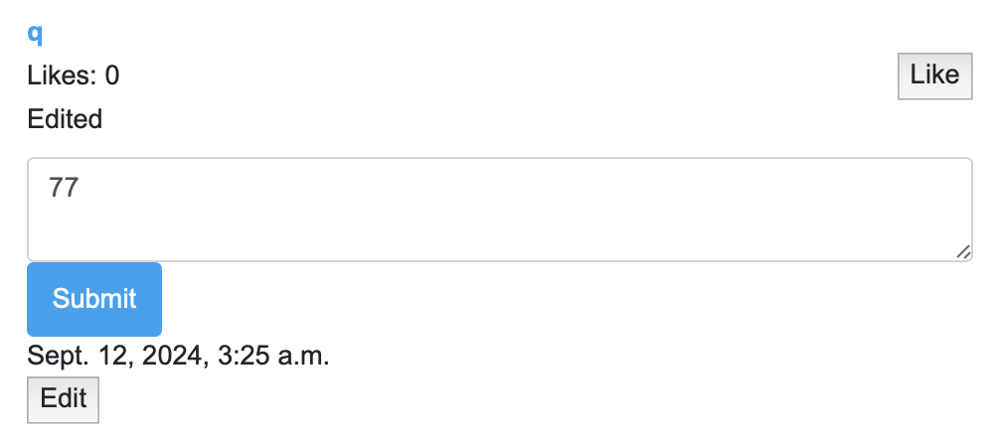

# Twitter-Clone

Network Web Application

**Overview**
This is a social media web application built using Django, JavaScript, and HTML/CSS. It offers features similar to popular social platforms, where users can create accounts, log in, and interact with each other's posts. Users can like, edit, and delete their own posts, follow other users, and view the posts of people they follow. Pagination is implemented to efficiently display large numbers of posts. The application prioritizes user authentication to manage access to key features like posting and following/unfollowing other users.

**Features**
1. User Registration and Authentication
Users can register an account, log in, and log out. Authentication is required for posting, editing, liking posts, and following/unfollowing users.

Key Functions
a. register: Handles user registration with validation for password confirmation and duplicate usernames.
b. login_view: Authenticates the user and redirects them to the home page upon success.
c. logout_view: Logs out the user and redirects them to the home page.

2. Post Creation and Editing
Authenticated users can create new posts and edit their own posts. Posts are displayed in reverse chronological order

Key Functions:
a. newPost: Handles post creation via a POST request. A JSON response is sent back with the status of the operation.
b. editView: Handles editing of a user's own posts. The post is updated based on the provided post ID and body content.

3. Liking and Unliking Posts
Users can like or unlike posts, which updates the like count in real-time. Posts display the current number of likes along with the "Like" or "Unlike" button, depending on the user's interaction with the post.

4. Profile View and Following
Users can visit the profile pages of other users to see their posts and can follow or unfollow others, with a toggle button available on each profile page.
Logged-in users can view the list of users they are following and see posts from all their followed users in a separate "Following" feed.

Key Functions:
a. profileView: Renders a user's profile page with a list of their posts and a button for following/unfollowing the profile owner.
b. followView: Handles the logic for following or unfollowing users, updating the database accordingly.
c. followPage: Displays the posts of all the users that the current user follows, sorted by time.

5. Pagination
All views where posts are displayed implement pagination, showing 10 posts per page.

**Setup Instructions**

Requirements:
Python 3.7+
Django 3.2+
JavaScript-enabled browser

Installation:
1. Clone the repository:
git clone <repository-url>
cd network

2. Install dependencies:
pip install -r requirements.txt

3. Run database migrations:
python manage.py migrate

4. Start the development server:
python manage.py runserver

Future Improvements
1. Implement real-time updates using WebSockets.
2. Improve the mobile responsiveness of the UI.

**Images of the Website**
Main page

Register

Login 

User page

Edit function

